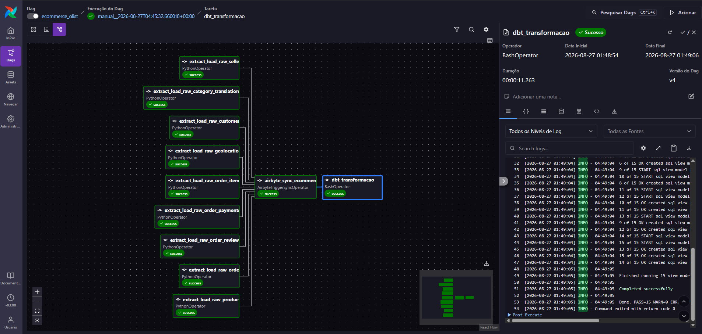

# 🛒 Ecommerce Pipeline

Projeto de estudo de engenharia de dados construído em cima do dataset público de e-commerce da Olist. A ideia foi simular, do início ao fim, como um pipeline de dados real funciona: buscar dados brutos na web, guardar em um banco, replicar para um data warehouse e transformar tudo em modelos analíticos prontos para consumo — tudo orquestrado automaticamente.

## O que o projeto faz

1. **Extração e carga**: baixa os datasets públicos da Olist (CSVs) direto da internet e carrega em um banco Postgres de origem.
2. **Replicação**: o Airbyte sincroniza esses dados brutos para um segundo Postgres, que funciona como o "data warehouse".
3. **Transformação**: o dbt lê os dados replicados e constrói as camadas de staging e os modelos analíticos (marts), aplicando testes de qualidade nos dados.
4. **Orquestração**: o Airflow comanda o processo inteiro, do primeiro ao último passo, com um único disparo.


## Tecnologias usadas

1. Airflow - Orquestador
2. Postgres - Banco de Dados
3. Airbyte - Extração/Carga
4. dbt - Transformador
5. GitHub - Versionamento de código
6. Docker - Ambiente desenvolvimento


## Estrutura do projeto
```
ecommerce-pipeline/
├── airflow/
│   ├── dags/
│   │   └── olist_pipeline_dag.py       # Orquestração (extract+load, Airbyte, dbt)
│   ├── plugins/olist/
│   │   ├── extract.py                  # Download dos datasets
│   │   ├── load.py                     # Carga no Postgres origem
│   │   └── pipeline.py                 # Junta extract + load por dataset
│   ├── docker-compose.override.yml     # Volumes extras (dbt dentro do container)
│   ├── requirements.txt
│   └── README.md
├── dbt/
│   └── olist_dw/
│       ├── models/
│       │   ├── staging/                # Views stg_* (espelho das tabelas raw)
│       │   └── marts/                  # Modelos analíticos (perguntas de negócio)
│       └── tests/                      # Testes customizados de qualidade de dados
├── data/                                # Reservado (não utilizado no fluxo atual)
├── docs/                                # Reservado para documentação extra
└── README.md                            # Este arquivo
```


## Como rodar
### Pré-requisitos

- Docker Desktop instalado e rodando
- [Astro CLI](https://www.astronomer.io/docs/astro/cli/install-cli) instalado
- dbt instalado localmente (`pip install dbt-postgres`)
- Airbyte rodando localmente via `abctl` ([guia oficial](https://airbyte.com/product/airbyte-open-source))

### Passo a passo

1. **Clone o repositório** e entre na pasta do projeto.

2. **Configure o `profiles.yml` do dbt**, na sua pasta pessoal (`~/.dbt/profiles.yml`), com as credenciais do Postgres destino. Esse projeto usa múltiplos targets — um para rodar local (`dev`) e outro para rodar dentro do container do Airflow (`docker`).

3. **Suba um Postgres separado**, que vai servir como o "destino" da réplica do Airbyte:
```bash
   docker run --name ecommerce-destino -e POSTGRES_PASSWORD=sua_senha -p 5585:5432 -d postgres:16
```

4. **Antes de subir o Airflow, defina as variáveis de ambiente** (necessárias para o `docker-compose.override.yml` montar o projeto dbt dentro do container):
```powershell
   $env:DBT_PROJECT_PATH="caminho/para/dbt/olist_dw"
   $env:DBT_PROFILES_PATH="caminho/para/.dbt/profiles.yml"
```

5. **Suba o ambiente do Airflow:**
```powershell
   cd airflow
   astro dev start
```

6. **Configure as Connections no Airflow** (`localhost:8080` → Admin → Connections):
   - `postgres_ecommerce`: aponta para o Postgres de origem
   - `airbyte_default`: aponta para a API do Airbyte local, usando as credenciais geradas por `abctl local credentials`

7. **Configure a Source, Destination e Connection no Airbyte** (`localhost:8000`), ligando o Postgres origem ao Postgres destino, com sincronização Full Refresh das 9 tabelas raw.

8. **Dispare a DAG `ecommerce_olist`** na interface do Airflow. Ela roda tudo em sequência: extração dos CSVs → carga no Postgres do Airflow (origem) → sincronização via Airbyte para o Postgres separado (destino) → transformação via dbt, direto nesse Postgres destino.


## Resultado

Pipeline completo rodando com um único disparo — extração, carga, sincronização via Airbyte e transformação via dbt, todas as etapas com sucesso:

